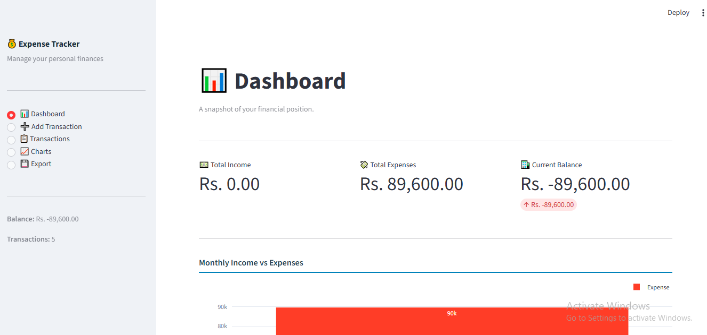
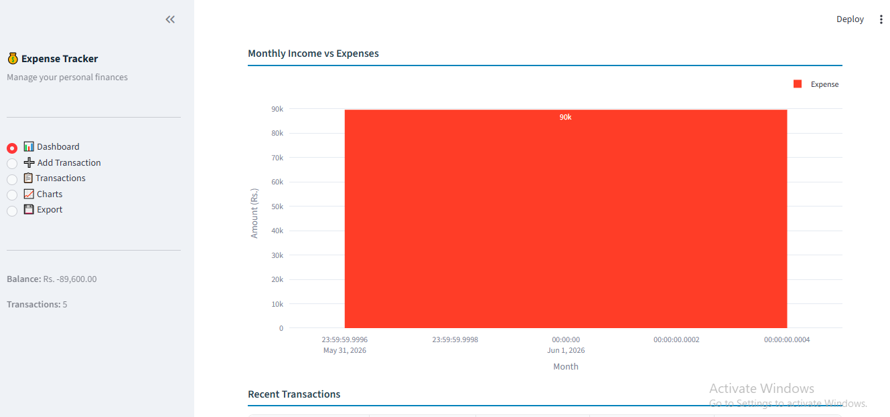
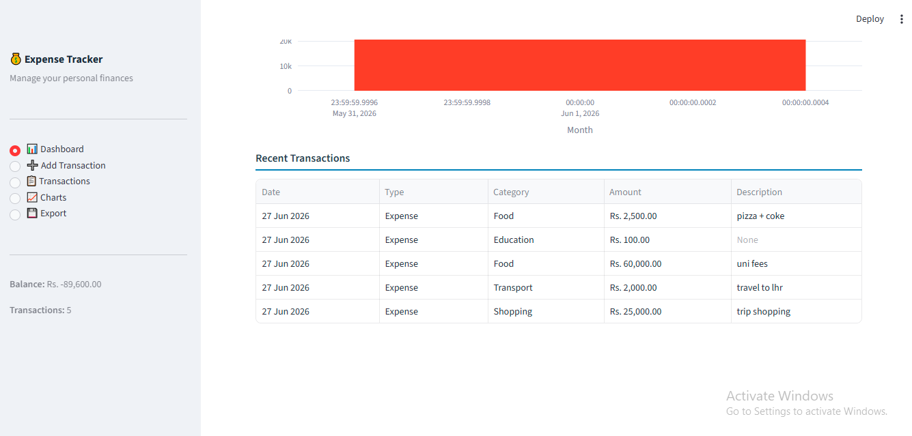
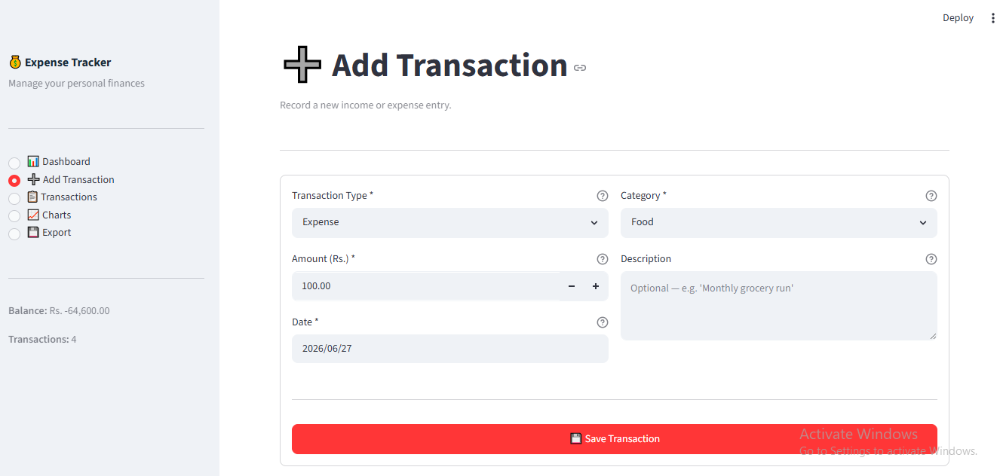
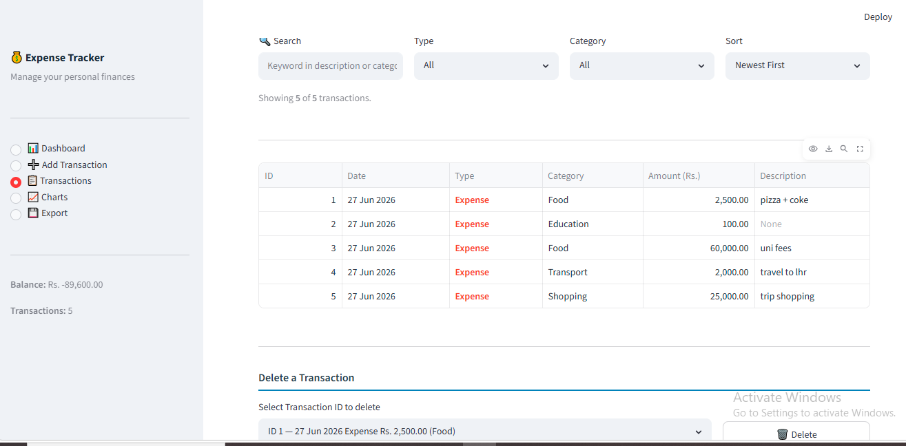
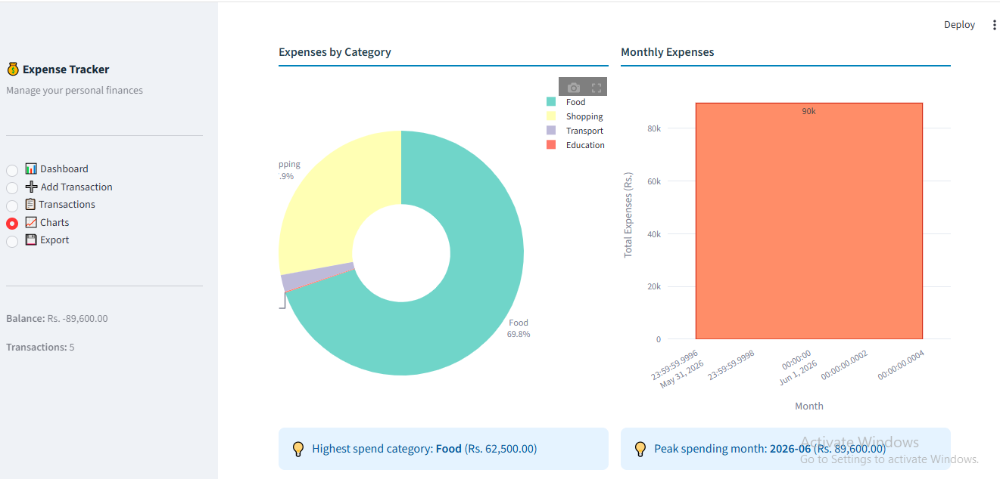
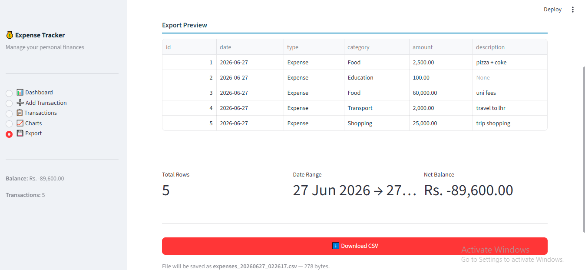

# Personal Expense Tracker

A modern and user-friendly Expense Tracker built with **Python**, **Streamlit**, **Pandas**, and **CSV**. This application helps users manage their income and expenses, track financial records, and visualize spending through interactive charts.

---

## Features

- Add Income & Expenses
- View All Transactions
- Search Transactions
- Filter by Category
- Sort by Date
- Delete Transactions
- Expense Charts
- Export Data to CSV
- CSV-based storage (No Database Required)

---

## Tech Stack

- Python
- Streamlit
- Pandas
- Matplotlib
- CSV

---


## ⚙️ Installation

```bash
git clone https://github.com/Aleesha1234/expense-tracker.git
cd expense-tracker

pip install -r requirements.txt
python -m streamlit run app.py
```

---

## Screenshots

### Dashboard







### Add Transaction



### Records



### Charts



### Export




## Author

**Aleesha Tariq**

GitHub: https://github.com/Aleesha1234
